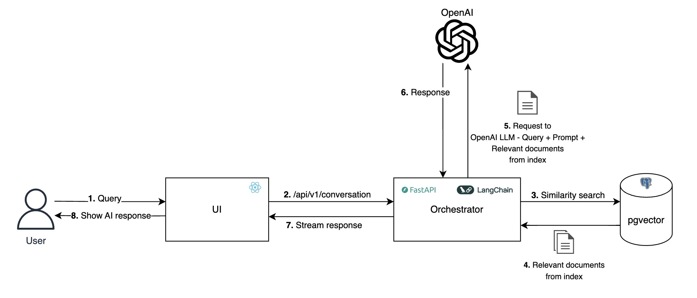

# AI-Powered Chatbot Application

QA chatbot is a system that uses a Retrieval-Augmented Generation (RAG) approach to provide accurate and contextually relevant answers to user queries. By indexing documents in a vector database and leveraging OpenAI's API, the application combines the retrieval based and generation based models for a seamless question answering experience.

## How it works

- **Indexing**: The data is converted into embeddings, numerical representations in the form of large vectors. RAG can be used on unstructured (usually text), semi-structured, or structured data.
- **Retrieval**: Given a user query, a document retriever selects the most relevant documents from the indexed data.
- **Augmentation**: The retrieved documents are fed into the LLM along with the original query, augmenting the prompt with relevant information.
- **Generation**: The LLM generates a response based on both the original query and the retrieved documents.

## Tech stack

- [pgvector](https://github.com/pgvector/pgvector)
- Python
- [LangChain](https://python.langchain.com/docs/introduction/)
- React
- Docker

## How to run locally

To run application locally make sure you have `Docker` installed. You can download [Docker Desktop](https://www.docker.com/products/docker-desktop/) for both Windows and MacOS.

1. Clone the repo and cd into it. All commands should be run from the terminal in project root directory.
2. Before proceeding extract `chat_bot_docs.tar` in `code/backend/data/docs` directory `tar -xvzf chat_bot_docs.tar -C code/backend/data/docs`.
4. `OPENAI_API_KEY` is required to enable application to talk to OpenAI servers. You can put your `OPENAI_API_KEY` in `docker-compose.yml` file on line [#31](https://github.com/jovanovicbogdan/chatbot/blob/master/docker-compose.yml#L31).
5. Run `docker compose up -d` and wait for docker to pull all the necessary images. After that make sure that all containers are up and running (`docker ps -a`). Check `status` column.
6. Assuming the containers are up and running the backend will start ingesting data. This process can take up to 45 minutes. This is for the first time only after that every time you run `docker compose up -d` the ingested data will be persisted on your system.
7. Run `docker ps -a` and copy container ID and run `docker logs -f {container_id}` to check if the indexing data has finished and application has started.
8. The backend is running on `http://localhost:8080` ([Swagger](http://localhost:8080/swagger)) and frontend on [http://localhost:8888](http://localhost:8888).
9. When you are done you can run `docker compose down` to remove running docker containers.

### Documents

- The location where to put documents that you want to ingest/index is `code/backend/data/docs` directory. Everything inside `docs` directory will be ingested. Please note that only text (markdown) format is supported.
- Better alternative is to use [/api/v1/update-docs](http://localhost:8080/swagger/#/default/update_docs_update_docs_post) endpoint to upload and ingest documents automatically. Be careful if you have on production (docker container in this case) `code/backend/data/docs/qabot` directory and you upload tar archive that doesn't contain `qabot` directory documents will be removed from index.
